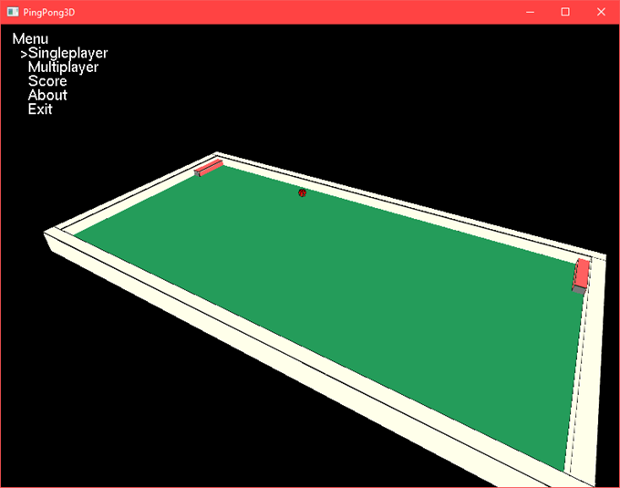
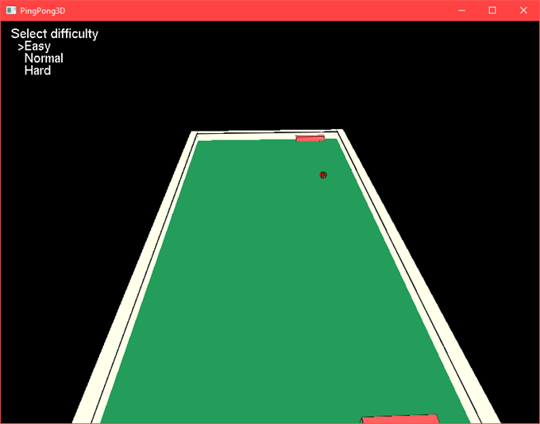
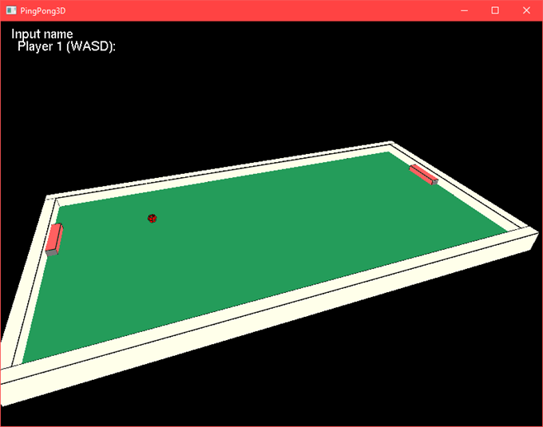
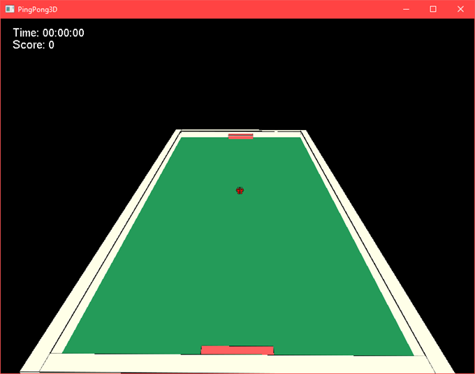
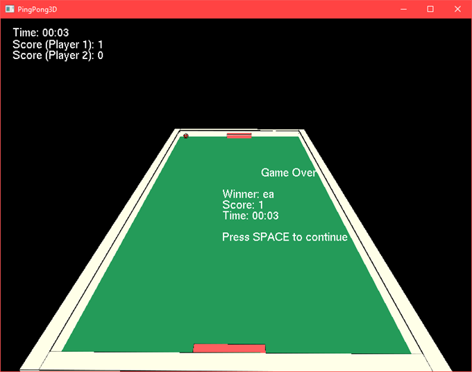
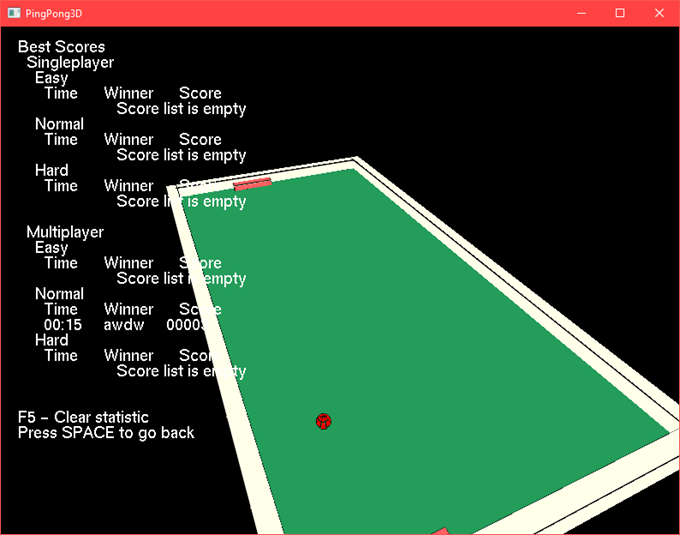
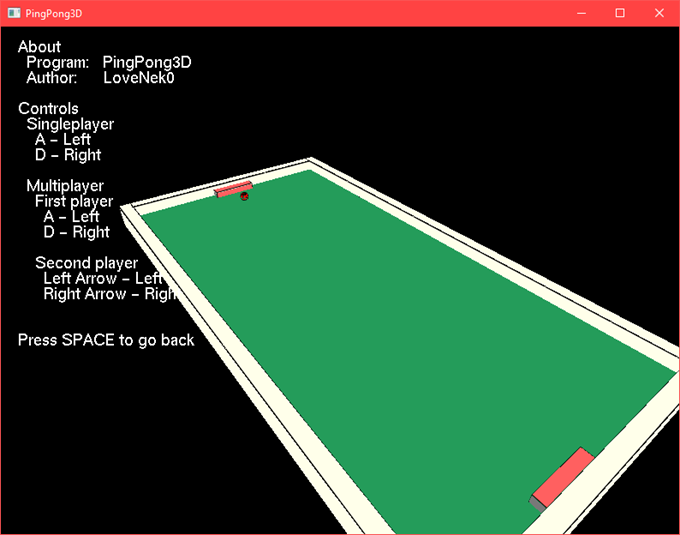

# PingPong3D
Ping-pong game in 3D

## Compilation
Before compiling you need to install [OpenGLUT](http://openglut.sourceforge.net/)

## Screenshots
Main menu

Select difficulty

Input first player name

Input second player name

In game

Game Over

Scores

About game
